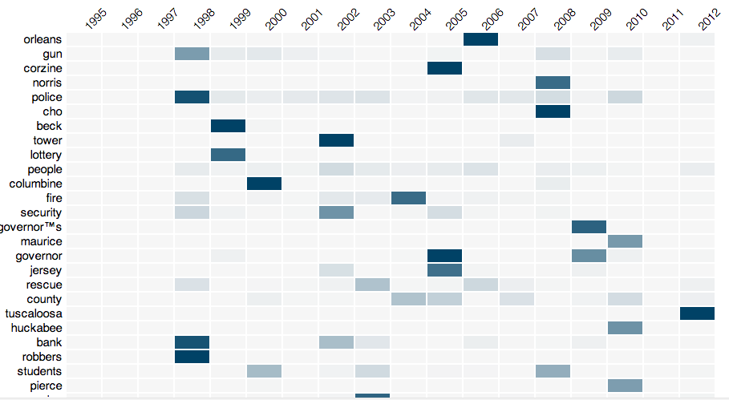

Impact Of Pulitzer Prize

====================

This is a textual analysis project, fetching stories from the current winners and finalists of the Pulitzer Prizes website (www.pulitzer.org).  It read and stored stories from 12 different fields of the finalists between 1995 and 2012 using Python. Topic modeling, Clustering and other techniques are used to do textual data mining. 

The final presentation is a collection of interactive heat-map and bar charts that shows how journalism pieces have been changing and affecting the society. 
 

Main Ideas: 
- TF-IDF 
- Topic Modeling
- Clustering 
- Visualization 

Tools Used: 
- Python: Gensim
- HTML/CSS
- Javascript: Google/D3 Lib
- XPDF 

Visualiztion: http://shujianbu.github.com/Impact_Of_Pulitzer_Prizes/
